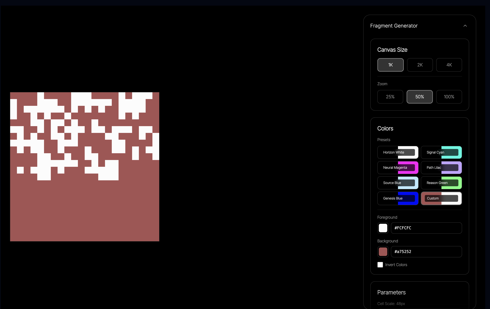
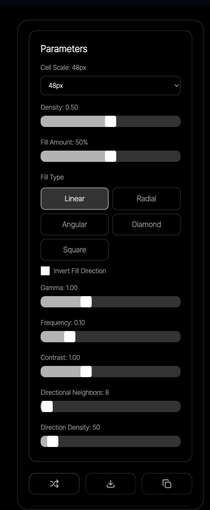

so what this app is is a tool for creating canvases with "pixels" colored in. the tool allows the user to change the color of the pixels, the density, orientation, and more. then the user can export the finalized svg, or copy it to clipboard.

 