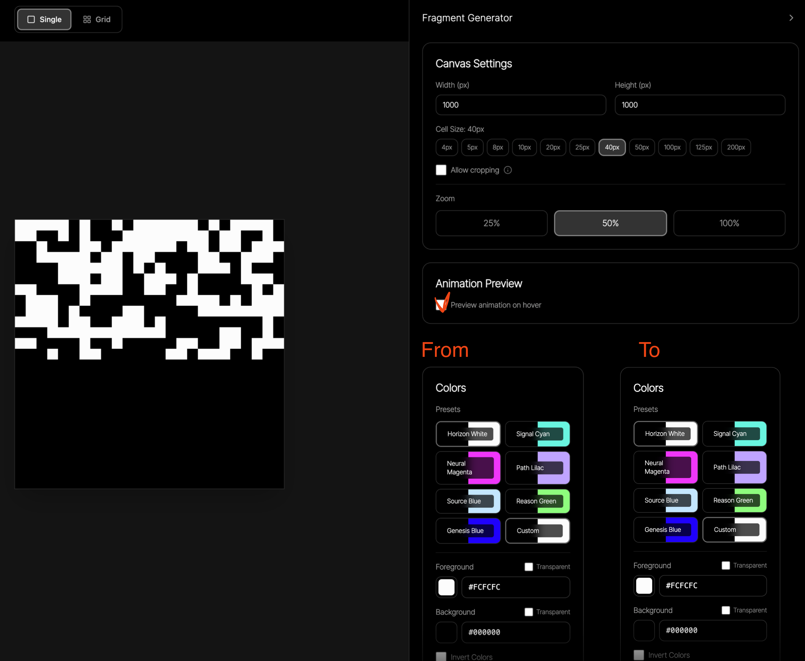

right now we have a "animation preview" section, which when you check the "Preview animation on hover" checkbox you're able to hover over the svg and see the animation from one seed to the other. It's the same svg that transitions between the two states, but with different rects shown/hidden based on their `data-g` attribute. The thing that changes when you change the seed is the "frequency" param. The effect, therefore is not overly drastic - the pattern just moves around a bit. But it would be great if, instead, we could have two completely different patterns which the svg transitions between on hover, for a more striking effect. I think this proposed design would work:  (if you cannot see this image tell me and do not proceed - it's important that you've seen it so that we're on the same page) - whereby when you check the animation preview box, you get a copy of the settings panel next to the original one. The original should have the title "From", and the copy should have the title "To". When you first check the box and the "to" panel appears, it should be initialized with the same settings as the "from" panel, except for the "frequency" attribute, which should be initialized with a random value (anything else - the "freq" attribute just changes the pattern a bit whilst maintaining the same overall structure). The user can then change any of the settings in the "to" panel to get a different pattern. The svg should then transition between the two patterns on hover, rather than just changing the frequency of the same pattern.

Aside from the obvious UI changes and so on, implementing this change will require some updates to the code which does the transition animation. I think it might be written to only expect one pattern and to transition between two states of that same pattern (based on the "freq" attribute). So we'll need to update it to be able to transition between two completely different patterns. When we export the configuration, how should we specify the transition between the two patterns? Perhaps the "from" config is implicitly still the config that's under the "config" attribute in the exported json, and then we can add a new "toConfig" attribute which contains the config for the "to" pattern. And then the `generateFragmentDiffSvg` function can take both configs as input and generate the combined svg. Or is there a better way to do this? Let me know your thoughts on the best way to implement this.

In terms of how to do this technically, here's one suggestion for how to implement this (key word suggestion):
Generate two separate svgs - one for the "from" pattern and one for the "to" pattern - and then to combine them into a single svg which contains all the rects from both patterns, but with different `data-g` attributes (e.g. `data-g="a"` for rects from the "from" pattern and `data-g="b"` for rects from the "to" pattern). Then we can update the animation code to fade out the "a" rects and fade in the "b" rects on hover, and vice versa on mouse leave. This way we can have two completely different patterns and still use a smooth fade transition between them. If we did it this way, I'm not sure if the above suggestion for exporting the config with a "toConfig" attribute would still be the best way to do it, as this would put the onus on the implementation code to create the two svgs and label the rects with the correct `data-g` attributes. But I think maybe we have to do it that way, because the implementation code runs upon e.g. window resizing and so it needs to be able to generate the correct svg based on the current "from" and "to" configs whilst adjusting the canvas. But I don't think the "from" config should be renamed in the config data structure, as it's still the main config for the pattern, and in case we don't support animation in some contexts, "from" is a misnomer. So I think we should keep the "config" attribute as the main config for the pattern, and then add a "toConfig" attribute for the animation target pattern. Then the implementation code can generate two svgs based on these configs and combine them into one svg with the appropriate `data-g` attributes for the animation, should animation be supported. Let me know if you have any thoughts or suggestions on this approach!