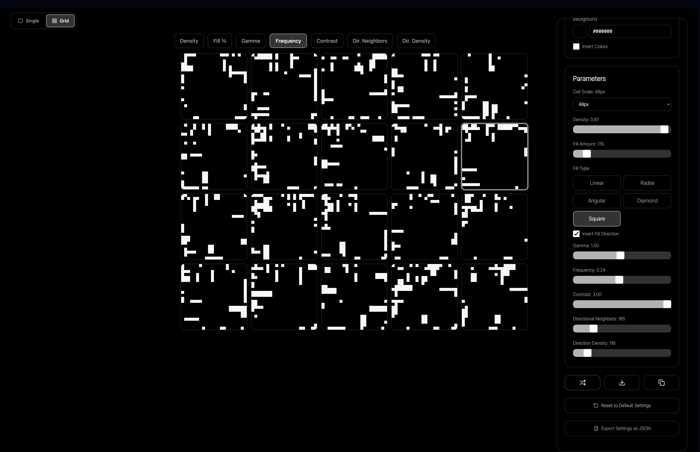
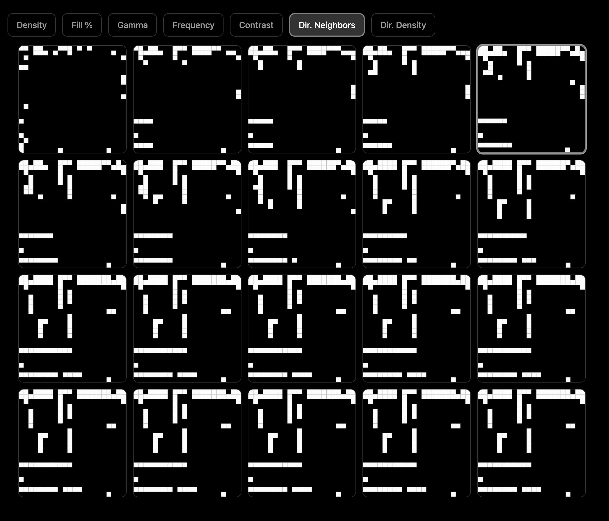

Take a look at the feat-1 directory to get an idea of what was previously done as it pertains to these fixes:

Only the "frequency" parameter is worth keeping, the rest of the parameters don't have enough variation to provide variations in the svg. The first image shows the grid with the "frequency" parameter varied across the grid. This is what we want to keep. Image 2 shows the grid with the "directional neighbours" parameter varied, which doesn't provide enough variation to be useful. So instead of the row of togglable options above the grid to select which parameter to vary, we should just have a label that says "Variations in the frequency parameter" above the grid.

This should be reflected in the export function as well. Here's an example of the exported json:

```json
{
  "version": "1.0.0",
  "exportedAt": "2026-02-04T15:24:04.740Z",
  "seedParam": "frequency",
  "config": {
    "threshold": 0.97,
    "gamma": 1.5,
    "frequency": 0.24,
    "contrast": 3,
    "seed": 0.7247077398616067,
    "directionalNeighbors": 185,
    "directionDensity": 118,
    "fillAmount": 11,
    "fillType": "square",
    "invertFill": true,
    "foregroundColor": "#FCFCFC",
    "backgroundColor": "#000000",
    "cellSize": 48,
    "canvasSize": "1K"
  }
}
```

But we can remove the seedParam field and just have the config object, since the seedParam is always going to be "frequency". 


