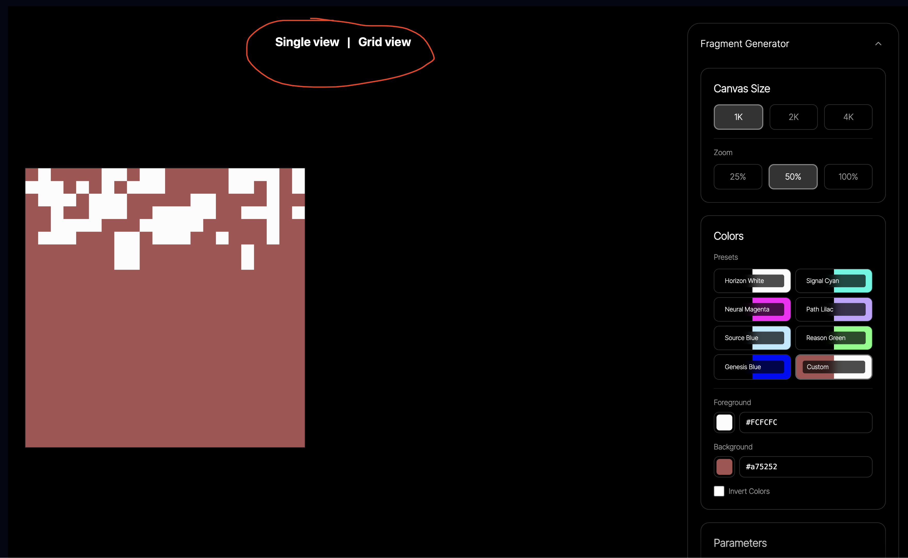

What this project does: it helps you generate an svg. These svgs are meant to be used instead of images on a website. E.g. if you have an articles component, instead of using images for the thumbnails of each article you can use these svgs. The look is this kind of digital, low-fi, pixelated style. We call each pixel a "fragment". Hence the name Fragment Maker. You configure various settings, such as pixel density, size, orientation, and so on, and then you can export the svg as a file or copy it to the clipboard. One setting is called "frequency", and what this does is affect what the svg looks like, whilst still adhering to the other settings. So you can have two svgs with the same size, pixel density, orientation, and so on, but with different frequency values, and they will look different. This is useful if you want to have a consistent style across your website, but still want some variation in the svgs.

(This project was created in figma's "make" mode, where you can generate apps based on prompts. I have copied the code from figma here to be able to further develop it.)

The end goal is for the website (in another repo) to have a function which can be called which will generate these svgs on the fly based on certain parameters. I want the function (let's call it generateFragmentSvg) to take in a string and a reference to a json file. The string will be used to seed the generation of the svg, so that the same string will always generate the same svg. The default parameter to seed the svg with is the "frequency" param, based on a hash of the string that gets passed in. The json file will contain the other parameters, such as size, pixel density, orientation, and so on. The json file can also specify which parameter to seed, so although "frequency" is the default one, the json file can specify e.g. "seedParam: density", and then that's the value that varies depending on the string that gets passed. The function will then return the svg as a string. This way, you can have consistent svgs for the same string (e.g. article title), but still have variation across different articles.

I think it would be useful to have this implemented into the current project/tool. So in the main view there could be a pair of of radio button (in the same style as the current UI) which says "Single view" and "Grid view" (). The "Single view" is what we currently have, but when "Grid" is selected, we no longer see the single svg preview, but instead we see 20 smaller svgs in a grid layout. These svgs should be generated based on the configuration done in the "configure" view, but each one's frequency value should be set based on their array index, so that they will all be different. The default variation parameter is "frequency", ut we should have a row above the grid with all the togglable options that make sense, so for example density, fill amount, gamma, etc, but not canvas size, colors, cell scale, or fill type. Frequency will be the setting that's selected by default, but if the user clicks on one of the other options, then that setting will be the one that is varied across the grid instead of frequency. This way, the user can see how the different settings affect the look of the generated svgs, and can verify that the configuration they have chosen works well across a range of values for the selected setting. The settings panel should still be visible on the right side, so that the user can tweak the configuration and see how it affects the grid of svgs in real-time.

Below the randomize, export, and copy buttons, we should have a button that says "Export settings as JSON". When clicked, this should download a json file containing the current configuration settings. This way, the user can save their configuration and use it elsewhere (e.g. on the website).

So for this feature request, we need to implement the following:
1. Add a "Grid view" option to the main view, alongside the existing "Single view" option.
2. When "Grid view" is selected, display a grid of 20 smaller svgs, each generated based on the current configuration but with a varying parameter (defaulting to frequency) that the user selects.
3. Add a row of togglable options above the grid to select which parameter to vary across the svgs.
4. Add an "Export settings as JSON" button below the existing buttons to download the current configuration as a json file.
5. Ensure that the settings panel remains visible and functional in "Grid view", allowing real-time updates to the grid based on configuration changes.
6. The function that generates the svgs in the grid should be modular and reusable, so that it can be easily integrated into the website's codebase later on. So ideally just defined in one file which I can then copy over to the website repo.

## Clarifications
- **Hashing algorithm:** Use djb2 for converting seed strings to numeric values. This ensures deterministic results that match between this tool and the website.
- **Grid interaction:** The grid is view-only (no click-to-apply). Hovering shows the exact parameter value used for that variation.

